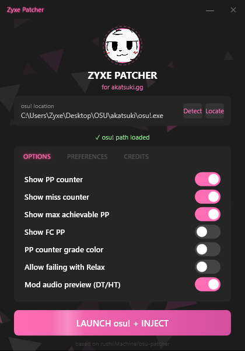
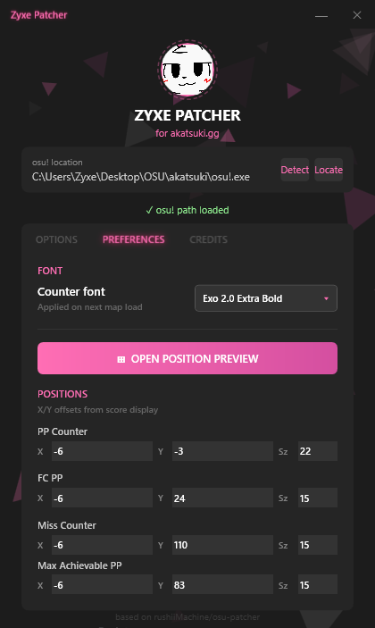
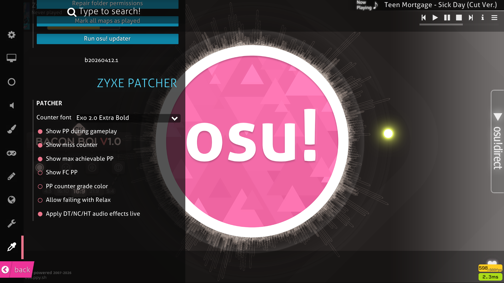

# Zyxe Patcher
### A patcher for [Akatsuki](https://akatsuki.gg) — the osu! private server

> Based on [rushiiMachine/osu-patcher](https://github.com/rushiiMachine/osu-patcher)

---

## Screenshots

<!-- Replace these with actual screenshots after uploading images to the repo -->

---

## Features

- **Live PP counter** — updates in real time as you play
- **Max achievable PP** — shows the highest PP you can still get (FC from here, keeping current misses)
- **FC PP counter** — what you'd get if you full combo'd from here at current accuracy
- **Miss counter** — tracks misses per map
- **PP counter grade color** — counter changes color based on your current grade
- **Allow failing with Relax** — enables the fail screen when using the RX mod
- **Mod audio preview** — hear DT/HT speed in song select before picking a map
- **Position preview** — drag and drop all counter positions visually
- **In-game settings** — configure everything directly from osu!'s options menu
- **Auto cleanup** — all injected DLLs are removed from your osu! folder when osu closes

---

## Requirements

- [.NET 8 Desktop Runtime (x86)](https://dotnet.microsoft.com/en-us/download/dotnet/8.0)
- [Visual C++ Redistributable (x86)](https://aka.ms/vs/17/release/vc_redist.x86.exe) *(you likely already have this)*

---

## Installation

1. Download the latest release from the [Releases](../../releases/latest) page
2. Extract the zip anywhere
3. Run `ZyxePatcher.exe`

---

## Usage

1. The patcher will auto-detect your osu! installation — if it doesn't, click **Locate** and point it at `osu!.exe`
2. Configure your toggles and counter positions in the **Options** and **Preferences** tabs
3. Click **Launch osu! + Inject** or press **Enter**
4. The patcher minimizes to the system tray — right-click the tray icon to reopen or exit
5. Counter fonts and positions can also be adjusted from osu!'s in-game settings menu

> ⚠️ When osu! closes, the patcher automatically removes all injected DLLs from your osu! folder so you stay clean on official servers.

---

## Credits

**Playtesters**
- R9xe_ow
- WhiteNose
- Foxzel

**Special Thanks**
- **Clumsie** — Helping with the autopilot PP rework history/logic
- **Flamme** — Helped with making PP counter fonts possible

**Based On**
- [rushiiMachine](https://github.com/rushiiMachine) — osu-patcher original creator
- [HorizonCode](https://github.com/HorizonCode) — osu-patcher original creator
